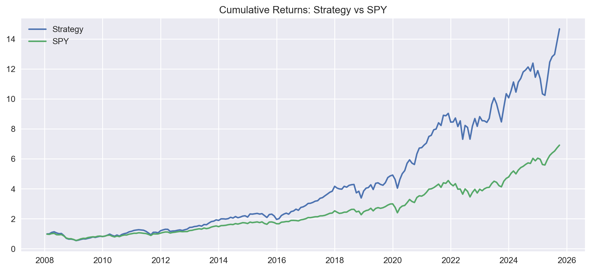
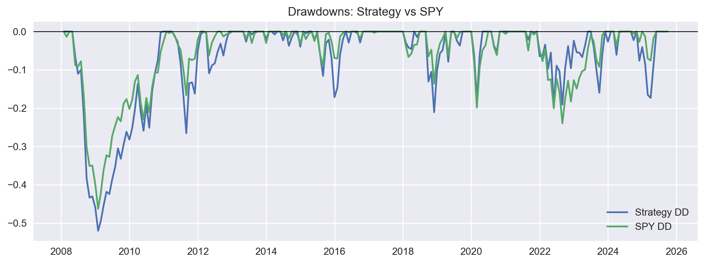
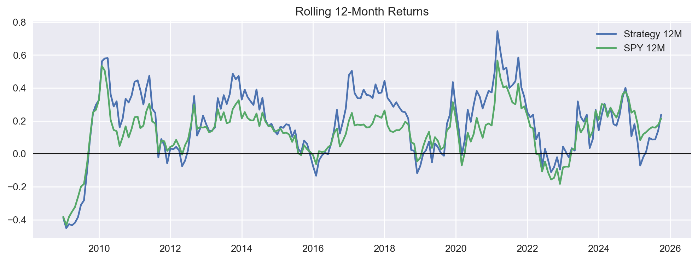
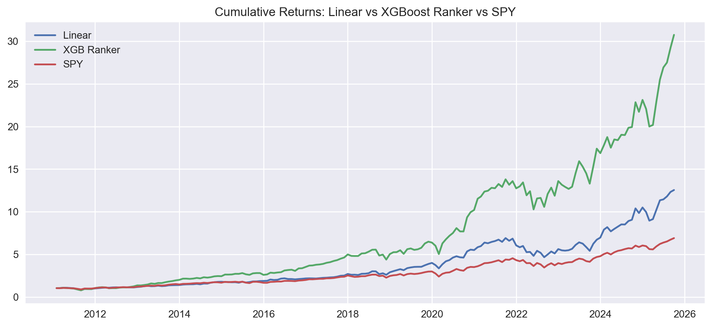

# Factor-Based Portfolio to Outperform the S&P 500 (SPY Benchmark)

## 1. Introduction
This project builds a **walk-forward** factor-based investing strategy using the **Fama–French 5-Factor (FF5)** model.

**Goal:** use only information available up to month `t-1` to form a month `t` long-only portfolio of S&P 500 constituents and benchmark against **SPY**.

**Repository:**
- https://github.com/Rayhanpatel/MSML-602-Final-Project-alphafoundry-ff5-sp500

**Final tutorial (GitHub Pages):**
- https://rayhanpatel.github.io/MSML-602-Final-Project-alphafoundry-ff5-sp500/

**Submission notebook (single merged workflow):** `one.ipynb`

## 2. Data Curation (sources + preprocessing)
We curate a monthly dataset from two public sources:

- **Fama–French 5 Factors + RF (daily)** (Ken French Data Library)
  - https://mba.tuck.dartmouth.edu/pages/faculty/ken.french/data_library.html
- **S&P 500 equities and SPY prices** via `yfinance`
  - https://pypi.org/project/yfinance/

**Notebook:** `one.ipynb` (Data curation section)

**Outputs (generated in `data/raw/`):**
- `ff5_data.csv` (daily factors)
- `market_data.csv` (monthly constituent returns)
- `sp500.csv` (current constituent list)
- `spy_monthly_returns.csv` (monthly SPY returns)

`one.ipynb` defaults to cached/offline mode and will use these files if present.

Note: even if `market_data.csv` begins in 2005, the backtest window starts later because the strategy uses rolling windows (e.g., 36-month beta estimation and a lagged factor forecast), which require an initial “burn-in” period.

## 3. Exploratory Data Analysis (EDA)
**Notebook:** `one.ipynb` (EDA section)

We include multiple statistical methods (with plots) and three high-level conclusions:

- **Method 1: Distribution + summary statistics**
  - Market factor (`Mkt-RF`) exhibits the largest volatility; other factors are smaller “tilts”.
- **Method 2: Outlier analysis (IQR rule)**
  - Stress regimes (e.g., crisis periods) create outliers; we keep them because they are economically real.
- **Method 3: Correlation + hypothesis test (Pearson)**
  - Monthly **SPY excess returns** are extremely correlated with `Mkt-RF` (as expected), and the correlation is statistically significant.

## 4. Primary / Machine Learning Analysis
**Notebook:** `one.ipynb` (single merged notebook)

### 4.1 Baseline model (rolling FF5 regression)
For each stock, we estimate rolling 36-month FF5 exposures using **excess returns**:

`R_excess = R_stock - RF`

We then forecast month `t` returns using:

- rolling betas estimated from months `< t`
- a **lagged** factor expectation (rolling mean shifted by 1 month)
- **no alpha/intercept** in the prediction signal (reduces overfitting risk)

Each month we go **long-only** and equal-weight the top 50 stocks by predicted signal.

### 4.2 Two-model ML comparison (Linear vs XGBoost learning-to-rank)
We compare two ML models in a walk-forward manner to rank stocks within each month, using the same feature set (rolling FF5 betas):

- **Model 1:** Logistic Regression (linear)
- **Model 2:** XGBoost learning-to-rank (`XGBRanker`)

## 5. Visualization (results)
`one.ipynb` saves plots to `docs/assets/`.

### Cumulative returns


### Drawdowns


### Rolling 12-month returns


### Linear vs XGBoost vs SPY (comparison)


## 6. Results Summary and Final Decision

- We evaluate all models **walk-forward** (no look-ahead): month `t` decisions use information available through `t-1`.
- In the latest run, **XGBoost learning-to-rank** outperformed the linear model and SPY on the aligned out-of-sample window (higher risk-adjusted performance).
- **Final model choice:** **XGBoost learning-to-rank**.

## 7. Data Science Ethics
Key ethical / fairness considerations for this project:

- **Survivorship bias:** `sp500.csv` reflects a modern constituent list; delisted names are missing. This can inflate historical performance.
- **Missingness bias:** IPOs and incomplete histories reduce training data and can change which names are eligible for selection.
- **Transparency:** we make the walk-forward timing explicit (`t-1` information only) and keep outputs reproducible via pinned dependencies.

## 8. Limitations
- Survivorship bias from constituent list construction.
- Missing data for IPOs/delistings and data gaps.
- **Transaction costs are not modeled in the default results (gross returns).** `one.ipynb` includes a simple turnover-based cost sensitivity check; adding realistic costs/slippage would likely reduce performance.

## 9. Reproducibility (how to run)
Install dependencies:

```bash
pip install -r requirements.txt
```

Run the notebooks in this order (Kernel: Restart & Run All):
1. `one.ipynb`

If `one.ipynb` reports missing CSV inputs:
- Set `USE_CACHED_DATA = False` at the top of the notebook to allow downloads and regenerate the cache.
- Then set it back to `USE_CACHED_DATA = True` for an offline/reproducible run.

## 10. References
- Ken French Data Library (Fama-French factors): https://mba.tuck.dartmouth.edu/pages/faculty/ken.french/data_library.html
- yfinance (Yahoo Finance data access): https://pypi.org/project/yfinance/
